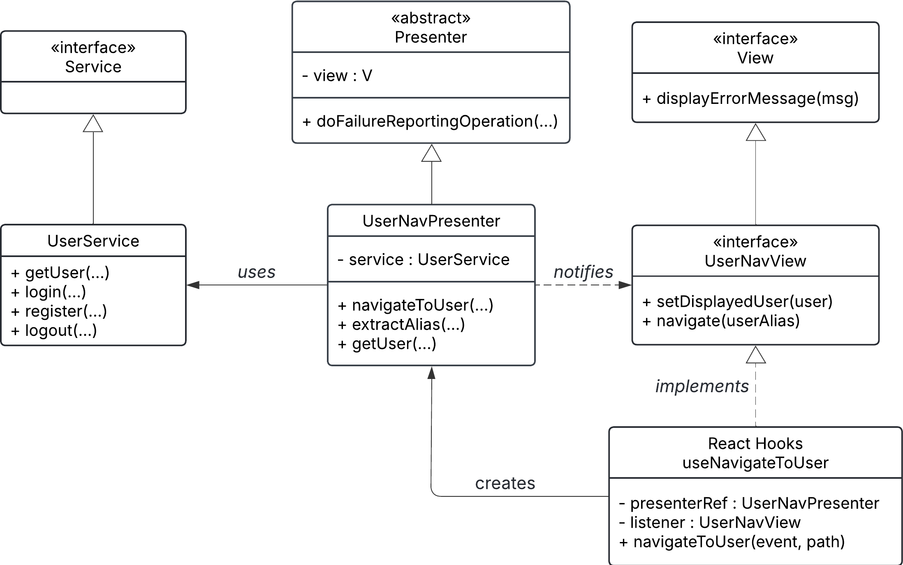
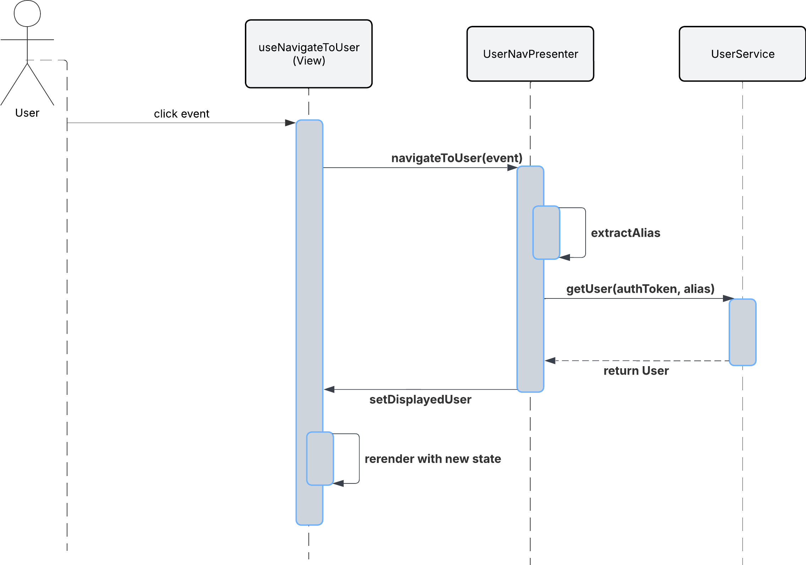
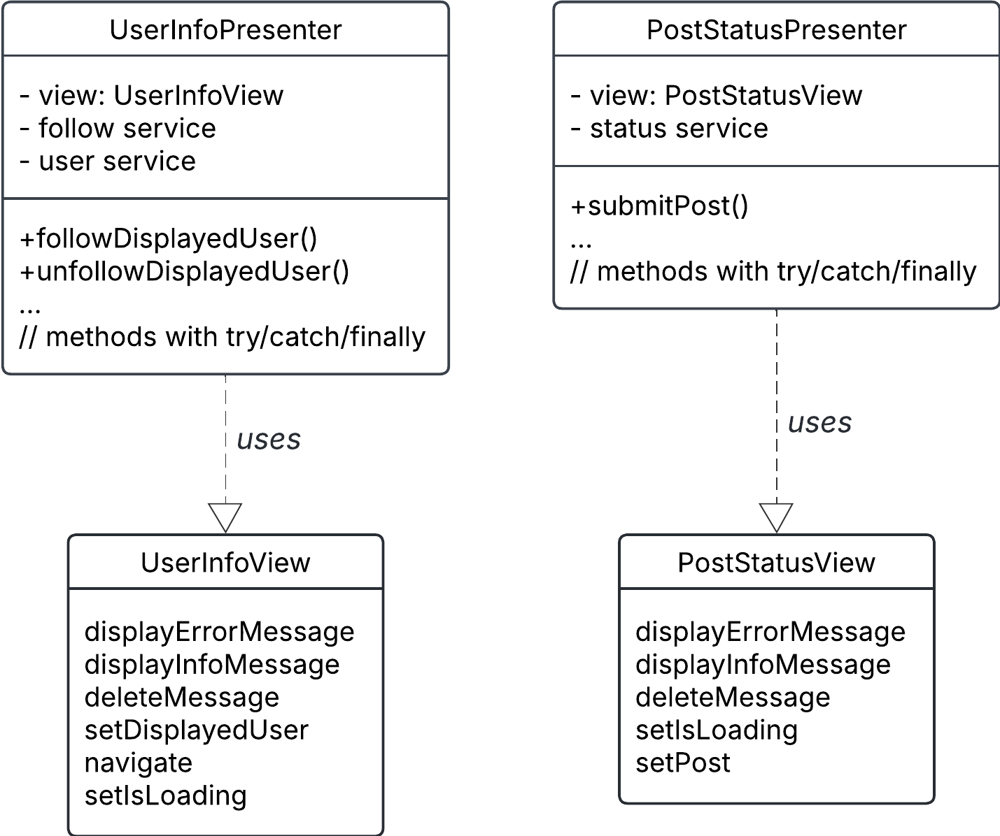
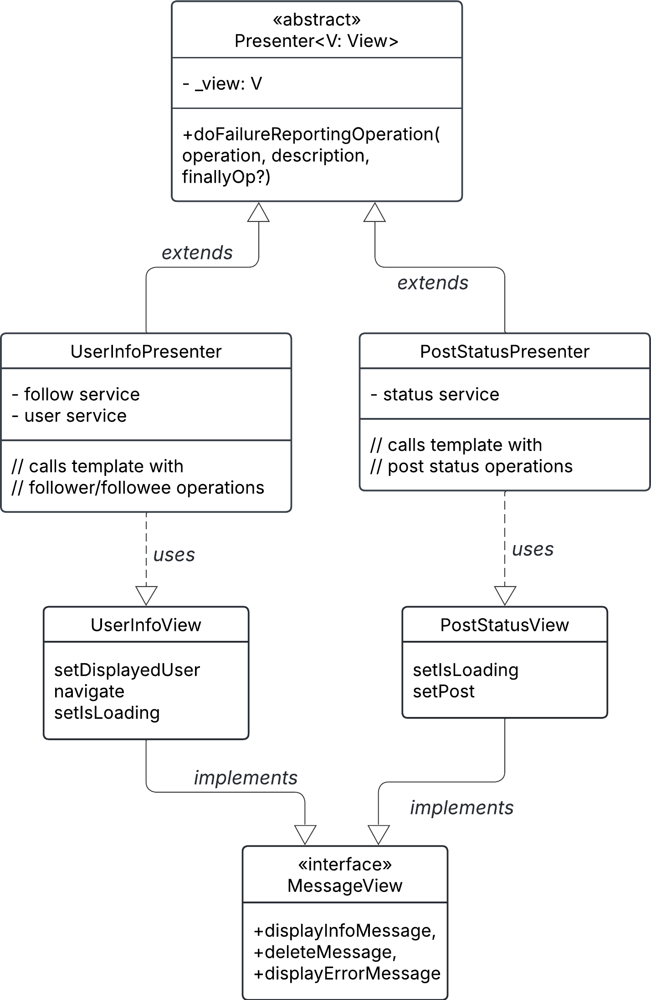

# M2C Documents

## Question 1: Review on M2A, MVP pattern, UML class/sequence diagrams

**1 . Which types (classes, interfaces, react components) play each of the key roles in the pattern (model, view, presenter)? How are those types related in your design and how was the observer design pattern used?**

In the Tweeter app, the Model–View–Presenter (MVP) pattern is implemented with the Service classes (`UserService`, `StatusService`, `FollowService`) as the Model, the React components and hooks in `src/components/` as the View, and the Presenter classes in `src/presenters/` (*see UML class diagram UserNavPresenter*) as the Presenter. The View passes user actions to the Presenter, which interacts with the Model and updates the View in return. The Observer pattern is used in the connection between the Presenter and View: the View registers itself as a listener when creating the Presenter, and the Presenter notifies the View of updates by calling its methods (like `setDisplayedUser`, `navigate`, or `displayErrorMessage`), allowing the UI to react to changes without containing business logic.

**2 . In brief what are 2 or 3 reasons why the MVP pattern is an effective choice for your design? You may want to refer to your diagram to support your reasoning.**

The MVP pattern is effective because it keeps the View simple and easy to read while separating business and server logic into the Presenter and Service classes. As shown in the sequence diagram, the View only calls the Presenter and waits for updates, while the Presenter alone interacts with the Model. I like that someone reading the code can quickly understand what the View does and see the business logic by reference through the presenter, and that the View interface cleanly handles communication back and forth—even if the observer pattern behind it is a bit confusing, it clearly works well.

 

**UML Class Diagram - UserNav**

 

**UML Sequence Diagram - UserNav**

  

## Question 2: M2B, template method pattern, 2 UML class diagram

**1 . Which classes play each of the key roles in the pattern? Describe the relationship between the classes and how they work together (including explaining what behavior is in the super class and what behavior is deferred to the subclasses).**

In the new design, the Template Method pattern is implemented in the abstract class `Presenter<V : View>`. The `Presenter` defines the method `doFailureReportingOperation(operation, description, finallyOperation?)`, which provides a fixed process for handling operations: it runs the operation inside a `try` block, catches exceptions to show an error message through the view, and performs optional cleanup in `finallyOperation`. The subclasses `UserInfoPresenter` and `PostStatusPresenter` extend `Presenter` and call this template method, supplying their specific logic (like following a user or posting a status). Both presenters depend on their corresponding view interfaces (`UserInfoView`, `PostStatusView`), which implement the shared `MessageView` interface that defines display and messaging behaviors.

**2 . Explain how the template method pattern allowed you to reduce code duplication. Please be specific and refer to the accompanying UML class diagrams as needed.**

Before the template method, both `UserInfoPresenter` and `PostStatusPresenter` had nearly identical `try/catch/finally` blocks in their methods for handling errors and cleanup. This led to duplicated code for showing error messages and toggling loading states. By introducing `doFailureReportingOperation()` in the shared `Presenter` superclass, this common logic was centralized. Each presenter now only provides the unique operation steps, while error handling and cleanup are handled consistently by the base class. This eliminated repetition, made the code cleaner, and ensured consistent error messages across all presenters.

 

**UML Class Diagram - Pre Template Method** 

(Design before the template method pattern was introduced)

 

**UML Class Diagram - Template Method** 

(Design after the template method pattern was introduced)

